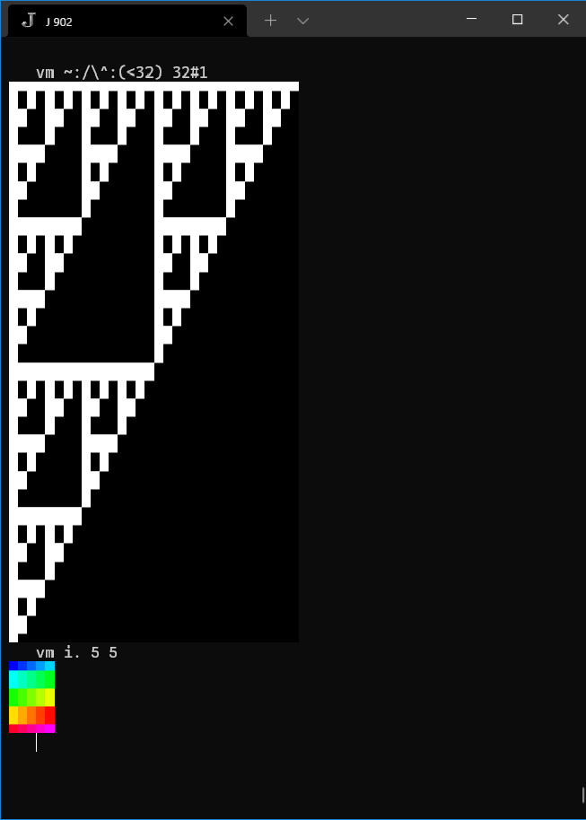
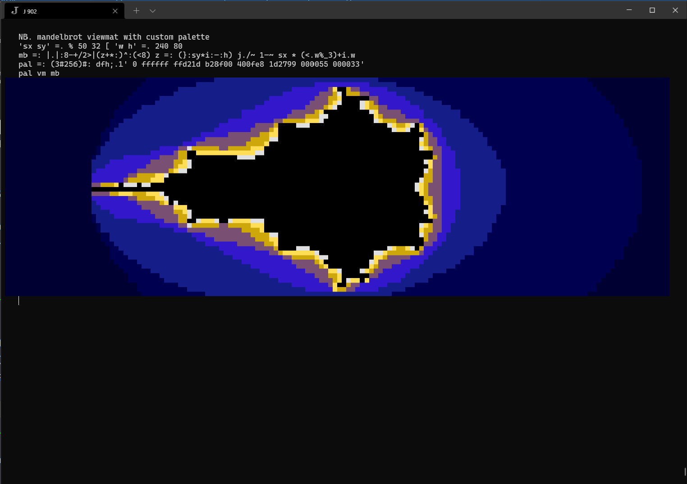
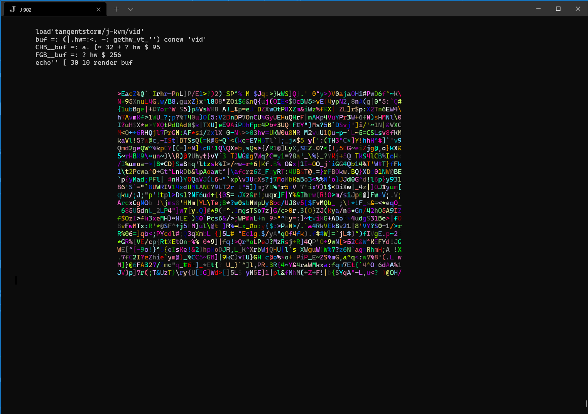

# j-kvm
Keyboard, Video, Mouse driver for console mode programming in J

Supports J902+ on Windows 10+, and Linux. (OSX is not yet working.)

**Note:** on windows, you need to run the `jconsole.exe` that comes with J, not `jqt` or `jhs`.

## Installation

    install'github:tangentstorm/j-kvm@main'

## Demos

There is a demo that shows how to use 256 colors and run an animation while waiting for a keypress:

    load'tangentstorm/j-kvm/vt'
    demo_vt_''

There are actually 24-bit colors available. Enough to run viewmat:

    load 'tangentstorm/j-kvm/vm'
    vm ~:/\^:(<32) 32#1  NB. sierpinski triangle
    vm i. 5 5            NB. normal viewmat colors

    NB. mandelbrot viewmat with custom palette
    'sx sy' =. % 50 32 [ 'w h' =. 240 80
    mb =: |.|:8-+/2>|(z+*:)^:(<8) z =: (}:sy*i:-:h) j./~ 1-~ sx * (<.w%_3)+i.w
    pal =: (3#256)#: dfh;.1' 0 ffffff ffd21d b28f00 400fe8 1d2799 000055 000033'
    pal vm mb

     load'tangentstorm/j-kvm/vid'

     NB. render a buffer of randomly colored characters
     buf =: (|.hw=:<. -: gethw_vt_'') conew 'vid'
     CHB__buf =: a. {~ 32 + ? hw $ 95
     FGB__buf =: ? hw $ 256
     echo'' [ 30 10 render buf

## Usage

There are three levels to the code here:

`load 'tangentstorm/j-kvm/vt'` to get basic low-level routines for generating VT100/ANSI/xterm escape codes, as well as platform-specific code for reading individual keypresses from the terminal.

`load 'tangentstorm/j-kvm/vid'` to work with in-memory 'video buffer' objects, which have separate rank 2 arrays for each character, foreground, and background attribute.

`load 'tangentstorm/j-kvm'` to get a high level `loop` adverb that provides an interactive event loop. Running `u loop_kvm_'locale'` provides an event loop that calls `u` on each tick, and runs event handlers in the given locale.

The event handlers are simple functions that handle individual keypresses:

  * `k_asc` handles any printable ascii character
  * `k_a` handles 'a'
  * `k_A` handles shift+'a'
  * `kc_a` handles control+'a'
  * `ka_a` handles alt+'a'
  * other key handlers:
    * `k_arup`, `k_ardn`, `k_arlf`, `k_arrt` (arrow keys)
    * `k_home`, `k_pgup`, `k_pgdn`, `k_ins`, `k_del`, `k_bksp`
    * `k_f1`, `k_f2`,.. (for function keys)
    * `k_sf1`, `k_sf2`,.. (shifted function keys)

The APIs for  `vt` and `vid` are the same. The intent is that you can draw everything to video buffers (composing multiple buffers however you like), and then `render` the final buffer with all the escape codes.

## Work to be Done

- add a small library of standard widgets (menus, text input buffers, etc..)
- push/pop for `vid` buffers
- render/compose `vid` buffers.
- handle alt+key
