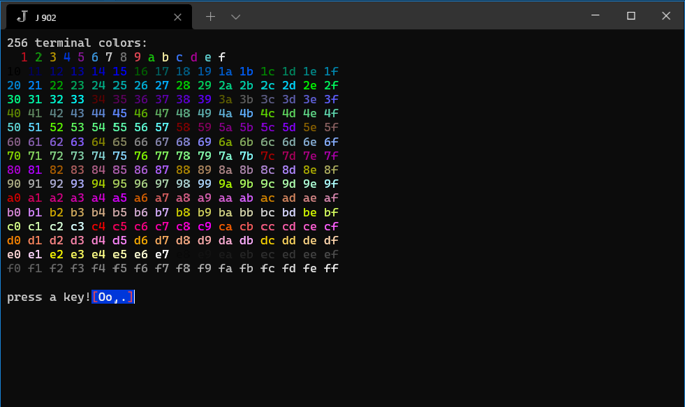

# j-kvm
Keyboard, Video, Mouse driver for console mode programming in J

Supports J902+ on Windows 10+, Linux, and (probably?) OSX.

**Note:** on windows, you need the stock `jconsole.exe` that comes with J, *and* you need to run it through the <a href="https://github.com/microsoft/terminal">"new" Windows terminal</a>.

## Installation

    install'github:tangentstorm/j-kvm@main'

## Demo

There is a demo that shows how to use 256 colors and run an animation while waiting for a keypress:

    load'tangentstorm/j-kvm/vt'
    demo_vt_''

## Usage

There are three levels to the code here:

`load 'tangentstorm/j-kvm/vt'` to get basic low-level routines for generating VT100/ANSI/xterm escape codes, as well ass platform-specific code for reading individual keypresses from the terminal.

`load 'tangentstorm/j-kvm/vid'` to work with in-memory 'video buffer' objects, which have separate rank 2 arrays for each character, foreground, and background attribute.

`load 'tangentstorm/j-kvm'` to get a high level `loop` adverb that provides an interactive event loop. Running `u loop_kvm_'locale'` provides an event loop that calls `u` on each tick, and runs event handlers in the given locale.

The event handlers are simple functions that handle individual keypresses:

  * `k_asc` handles any printable ascii character
  * `k_a` handles 'a'
  * `k_A` handles shift+'a'
  * `kc_a` handles control+'a'
  * other key handlers:
    * `k_arup`, `k_ardn`, `k_arlf`, `k_arrt` (arrow keys)
    * `k_home`, `k_pgup`, `k_pgdn`, `k_ins`, `k_del`, `k_bksp`
    * `k_f1`, `k_f2`,.. (for function keys)
    * `k_sf1`, `k_sf2`,.. (shifted function keys)

The APIs for  `vt` and `vid` are the same. The intent is that you can draw everything to video buffers (composing multiple buffers however you like), and then `render` the final buffer with all the escape codes.

## Work to be Done

- add a small library of standard widgets (menus, text input buffers, etc..)
- push/pop for `vid` buffers
- render/compose `vid` buffers.
- handle alt+key
